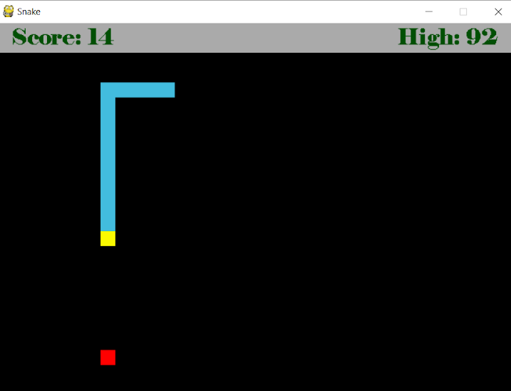
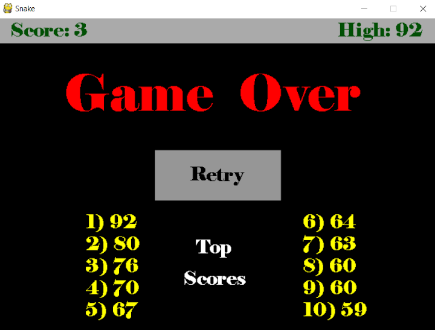

## Snake

Recreation of classic 'Snake' game using pygame

To run, download all files. Then, using a command prompt, navigate to the file with Main.py installed. Note: if PyGame is not intsalled, type "pip install pygame". Once you ensure that pygame is installed, type "python Main.py" and then the game will start.

Features:
  - Enable/Disable wall collision ending game
  - High scores saved upon exiting
  - New snake color every game
  - Current score and high score displayed while in game

Screenshots:

